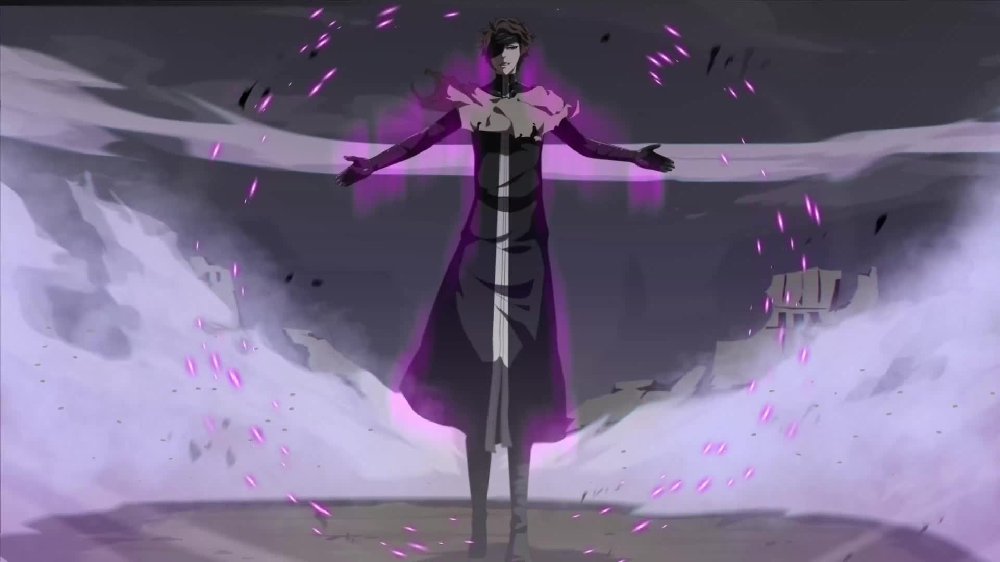

<!-- Domain Expansion GIF -->

<!-- Name under domain -->

  

<!-- Aizen Throne -->

  

<!-- Full width divider -->

<!-- Aizen Power -->

<!-- Kyoka Suigetsu -->

<!-- Kanji -->

  

<!-- Divider -->

  

<!-- Roles -->

  

<!-- Badges -->

  
  
  
  

  

⚉ About Me — Reiatsu Flow

    ╔══════════════════════════════════════════════════════════════════╗
    ║  ⚉  Kidō Mastery                    ████████████████░░░░  100% ║
    ║  ⚉  Zanjutsu Expert                 ████████████████░░░░  100% ║
    ║  ⚉  Hohō Flash God                  ████████████████░░░░  100% ║
    ║  ⚉  Hakuda Combat                   ███████████████░░░░░   95% ║
    ║  ⚉  Intellect Transcendent          ████████████████░░░░  100% ║
    ╚══════════════════════════════════════════════════════════════════╝

⚉ Innate Technique — Soul Reaper Stack

  

  
  
  
  
  
  

  
  
  

⚉ Featured Technique — Kyōka Suigetsu Domain
<table align="center">
  <tr>
    <td align="center" width="50%">
      
    </td>
    <td align="left" width="50%">
      <h3 align="center">◈ Domain: Kanzen Saimin ◈</h3>
      

        
        
      

      <ul>
        <li>⚉ Complete Hypnosis — Five Senses Control</li>
        <li>⚉ Eternal Illusion — Once Seen, Always Bound</li>
        <li>⚉ Reiatsu Suppression — Undetectable Presence</li>
        <li>⚉ Absolute Deception — Reality Manipulation</li>
      </ul>
    </td>
  </tr>
</table>

⚉ Battle Stats — Spiritual Pressure

  
  

  

  

  

  

⚉ Espada Roster — Arrancar Army
<table align="center">
  <tr>
    <td align="center"><b>#</b></td>
    <td align="center"><b>Name</b></td>
    <td align="center"><b>Aspect</b></td>
    <td align="center"><b>Status</b></td>
  </tr>
  <tr>
    <td align="center">1</td>
    <td align="center">Coyote Starrk</td>
    <td align="center">Solitude</td>
    <td align="center">💀</td>
  </tr>
  <tr>
    <td align="center">2</td>
    <td align="center">Baraggan Louisenbairn</td>
    <td align="center">Aging</td>
    <td align="center">💀</td>
  </tr>
  <tr>
    <td align="center">3</td>
    <td align="center">Tier Harribel</td>
    <td align="center">Sacrifice</td>
    <td align="center">✅</td>
  </tr>
  <tr>
    <td align="center">4</td>
    <td align="center">Ulquiorra Cifer</td>
    <td align="center">Emptiness</td>
    <td align="center">💀</td>
  </tr>
  <tr>
    <td align="center">5</td>
    <td align="center">Nnoitra Gilga</td>
    <td align="center">Despair</td>
    <td align="center">💀</td>
  </tr>
  <tr>
    <td align="center">6</td>
    <td align="center">Grimmjow Jaegerjaquez</td>
    <td align="center">Destruction</td>
    <td align="center">✅</td>
  </tr>
</table>

⚉ Hōgyoku Evolution — Forms of Transcendence
<table align="center">
  <tr>
    <td align="center"><b>Form</b></td>
    <td align="center"><b>Appearance</b></td>
    <td align="center"><b>Power Level</b></td>
  </tr>
  <tr>
    <td align="center">Standard</td>
    <td align="center">Glasses, Brown Hair</td>
    <td align="center">Captain</td>
  </tr>
  <tr>
    <td align="center">Post-Hōgyoku</td>
    <td align="center">Slicked Back Hair</td>
    <td align="center">Transcendent</td>
  </tr>
  <tr>
    <td align="center">Chrysalis</td>
    <td align="center">White Cocoon</td>
    <td align="center">Evolving</td>
  </tr>
  <tr>
    <td align="center">First Fusion</td>
    <td align="center">White Armor</td>
    <td align="center">Near-God</td>
  </tr>
  <tr>
    <td align="center">Second Fusion</td>
    <td align="center">Butterfly Wings</td>
    <td align="center">Godlike</td>
  </tr>
  <tr>
    <td align="center">Final Form</td>
    <td align="center">Monster</td>
    <td align="center">Ultimate</td>
  </tr>
</table>

⚉ Famous Quotes — Words of a God
<table align="center">
  <tr>
    <td align="center"><b>Japanese</b></td>
    <td align="center"><b>English</b></td>
    <td align="center"><b>Context</b></td>
  </tr>
  <tr>
    <td align="center">私は神になりたいのではない。神を超えたいのだ。</td>
    <td align="center">"I do not wish to become God. I wish to surpass Him."</td>
    <td align="center">Ambition</td>
  </tr>
  <tr>
    <td align="center">絶望とは、完全に目を開いた状態である。</td>
    <td align="center">"Despair is a state of having one's eyes fully open."</td>
    <td align="center">Philosophy</td>
  </tr>
  <tr>
    <td align="center">戦いとは、欺き合いである。</td>
    <td align="center">"Battle is a matter of mutual deception."</td>
    <td align="center">Strategy</td>
  </tr>
  <tr>
    <td align="center">鏡に映る花の如く、水に映る月の如く。</td>
    <td align="center">"Like the flower in the mirror, like the moon on the water."</td>
    <td align="center">Kyōka Suigetsu</td>
  </tr>
</table>

⚉ Contact — Spiritual Link

  
  
  

  

  

  

