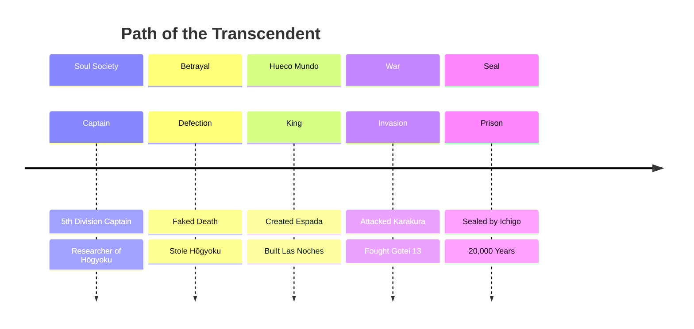

readme_content = """<div align="center">


# ⚔️ 鏡花水月 · KYŌKA SUIGETSU ⚔️

**「汝、ひとりの死神を見たことか？」**

*"Have you ever seen a single Shinigami?"*

</div>

---

## 🌙 破面の王 (King of Hueco Mundo)

> *「恐れることはない。私はお前を殺さない。お前には価値があるからだ。」*
> 
> *"Fear not. I shall not kill you. You have value."*

<div align="center">

| **Rank** | **Espada #1** | **Aspect of Death** | **Solitude** |
|:--------:|:-------------:|:-------------------:|:------------:|
| **Zanpakutō** | 鏡花水月 (Kyōka Suigetsu) | **Shikai** | 砕けよ、鏡花水月 (Shatter, Kyōka Suigetsu) |
| **Bankai** | — | **Type** | Illusion-type | 

</div>

---

## 🎭 完全催眠 (Kanzen Saimin)

```
┌─────────────────────────────────────────────────────────────┐
│  支配者の右目に触れし者、鏡花水月の幻に囚われる。            │
│  "Those who touch the ruler's right eye are trapped         │
│   in the illusion of Kyōka Suigetsu."                       │
└─────────────────────────────────────────────────────────────┘
```

### ✨ Abilities

- **🌀 Hypnosis** — Controls the five senses to the point where victims cannot discern reality
- **🌊 Water & Moon** — Like the flower reflected in the mirror and the moon on the water's surface
- **👁️ Aizen's Gaze** — Once seen, the hypnosis is absolute and eternal
- **⚡ Reiatsu Suppression** — Hides spiritual pressure completely

---

## 🏰 Las Noches Architecture

```
    ╔═══════════════════════════════════════════════╗
    ║                                               ║
    ║     ┌─────────┐        ┌─────────┐           ║
    ║     │  TOWER  │════════│  THRONE │           ║
    ║     │   #1    │        │  ROOM   │           ║
    ║     └────┬────┘        └────┬────┘           ║
    ║          │                  │                 ║
    ║     ┌────┴────┐        ┌────┴────┐           ║
    ║     │  ESPADA │════════│  REIATSU│           ║
    ║     │ QUARTERS│        │  CORE   │           ║
    ║     └─────────┘        └─────────┘           ║
    ║                                               ║
    ║         ☠️ 虚夜宮 (LAS NOCHES) ☠️              ║
    ╚═══════════════════════════════════════════════╝
```

---

## 🌑 崩玉 (Hōgyoku)

<div align="center">

| **Evolution Stage** | **Description** | **Status** |
|:-------------------:|:---------------|:----------:|
| **🔵 Sealed** | Hidden within Rukia's Gigai | ✅ Complete |
| **🟣 Awakened** | Fused with Aizen's soul | ✅ Complete |
| **⚫ Transcended** | Breaking the boundary between Shinigami and Hollow | ✅ Complete |

</div>

---

## 📜 百年前の真実 (Truth of 100 Years Ago)

> *「私は神になりたいのではない。神を超えたいのだ。」*
>
> *"I do not wish to become God. I wish to surpass Him."*

### Timeline of Ascension



---

## 🎨 Visual Identity

<div align="center">

| Element | Value |
|---------|-------|
| **Primary** | `#7C3AED` *(Violet Throne)* |
| **Secondary** | `#1E1B4B` *(Midnight Reiatsu)* |
| **Accent** | `#C4B5FD` *(Spiritual Pressure)* |
| **Text** | `#F5F3FF` *(Moonlight)* |
| **Warning** | `#EF4444` *(Blood of Enemies)* |

</div>

---

## ⚔️ 戦闘データ (Combat Statistics)

```
Reiatsu:    ████████████████████ 9999+ (Immeasurable)
Zanjutsu:   ████████████████████ Master
Hakuda:     █████████████████░░░ Expert  
Hohō:       ████████████████████ Flash God
Kidō:       ████████████████████ Grandmaster
Intellect:  ████████████████████ Transcendent
Charisma:   ████████████████████ Absolute
Arrogance:  ████████████████████ Maximum
```

---

## 🌟 名言集 (Famous Quotes)

> *「あまりにも強大な力は、時として自分の目で見ることすら許されない。」*
>
> *"Power so vast that sometimes one is not even allowed to see it with their own eyes."*

> *「絶望とは、完全に目を開いた状態である。」*
>
> *"Despair is a state of having one's eyes fully open."*

> *「戦いとは、欺き合いである。」*
>
> *"Battle is a matter of mutual deception."*

---

## 🔮 鏡花水月の解放 (Release Command)

<div align="center">

### **砕けよ、鏡花水月**
### *"Shatter, Kyōka Suigetsu"*


</div>

---

<div align="center">

**「これが藍染惣右介の力だ。」**

*"This is the power of Sōsuke Aizen."*


</div>

---

<div align="center">

*「鏡に映る花の如く、水に映る月の如く。」*

*"Like the flower reflected in the mirror, like the moon reflected on the water's surface."*

</div>
"""

# Save the file with .readme extension
output_path = "/mnt/agents/output/README_Aizen.readme"
with open(output_path, "w", encoding="utf-8") as f:
    f.write(readme_content)

print("README файл создан успешно!")
print(f"Путь: {output_path}")
print(f"Размер: {len(readme_content)} символов")
